<h1 align="center"><b><a href="https://www.angelcoin.money" target="_blank">OFFICAL WEB SITE</a></b></h1>
<h2 align="center"><a href="https://www.angelcoin.money" target="_blank">visit the website for the actual and newest updates</a></h2>

 

<table class="summary">
<tr><th>Customers</th><th>Price</th><th>Referral</th></tr>
<tr><td>233</td><td>1.10$</td><td>10%</td></tr>
</table>

<i title="Next update within 24 hours">Updated before:</i> [8h 22m]

<h2>Investment opportunities:</h2>
<ol type="I">
<li>Available for selling 2.147 billions premined coins for administration and maintenance, encrypted cloud storages, cloud hosting, airdrops, rewards, bounties, marketing and future development</li>
<li>Types of Investment:
	<ol type="1">
	<li><b>PUBLIC INVESTMENT</b>: Your purchased Angecoins [ALC] will be public/visible to the public (through official block explorer/blockchain of the Angelcoin network). You are full responsible for the security and health of your Angelcoin related wallets, private keys or software</li>
	<li><b>PRIVATE INVESTMENT</b>: Your purchased Angelcoins [ALC] will be private/hidden to the public (through official block explorer/blockchain of the Angelcoin network). No need to deal with Angelcoin related wallets, private keys, security or software</li>
	</ol>
</li>
<li>Ways to obtain Angelcoins [ALC]:
	<ol type="1">
	<li>Free: with mining, but the users can't use the referral system</li>
	<li>Paid: with direct purchase of desired amount of ALC coins from the only legitimist and official place- https://www.angelcoin.money. In this case the users can use the referral system for good</li>
	<li>Paid: with purchase from any other places. In this case the users cannot use the referral system and will lost for good all current referrals if have any. Also, the possibility to be scammed and lose everything is very high in this case!</li>
	</ol>
</li>
<li>Procedure to obtain Angelcoins [ALC]:
	<ol type="1">
	<li>Fill and send the "<mark>Order for purchasing of desired amount of Angelcoins [ALC] coins with Bitcoins [BTC]</mark>"
(or send email to <a href="&#109;&#097;&#105;&#108;&#116;&#111;&#58;&#102;&#117;&#110;&#100;&#64;&#97;&#110;&#103;&#101;&#108;&#99;&#111;&#105;&#110;&#46;&#109;&#111;&#110;&#101;&#121;">&#102;&#117;&#110;&#100;&#64;&#97;&#110;&#103;&#101;&#108;&#99;&#111;&#105;&#110;&#46;&#109;&#111;&#110;&#101;&#121;</a> with all required data fields)
</li>
	<li>You will receive shortly the individual BTC address only for your current/future investments in Angelcoin</li>
	<li>Make the payment- send your bitcoins to that address</li>
	<li>After at least 6 confirmations in BTC network, you will receive shortly:
		<ul>
		<li>the confirmation invoice email about your BTC payment
		<li>the respective Angelcoin amount in your ALC address
		</ul>
	</li>
	</ol>
</li>
<li><mark>Order for purchasing of desired amount of Angelcoins [ALC] coins with Bitcoins [BTC]</mark>:
	<table class="order">
	<tr><td>USD:</td><td><input id="usd" type="number" placeholder="$" onkeyup="calcUSD(this)" maxlength="20" min="0.01" max="1000000.00" pattern="[0-9]+([,\.][0-9]+)?" step="0.01" required />visit the website</td><td>ALC address:</td><td><input id="alca" type="text" placeholder="your ALC address" maxlength="40" required />visit the website</td><td>REFERRAL CODE (optional):</td><td><input id="referralcode" type="number" value="10%" placeholder="your r. code (optional)" maxlength="14" pattern="[0-9]" step="1"/>visit the website</td></tr>
	<tr><td>BTC:</td><td><input id="btc" type="number" placeholder="BTC coins" onkeyup="calcBTC(this)" maxlength="20" min="0.00000001" max="1000000.00000000" pattern="[0-9]+([,\.][0-9]+)?" step="0.00000001" required />visit the website</td><td>BTC address:</td><td><input id="btca" type="text" placeholder="your BTC address" maxlength="40" required />visit the website</td><td>INVESTMENT TYPE:</td><td><input id="publicity" type="radio" name="publicity" onclick="toggleInvestmentType()" checked /><label for="publicity">a)Public</label><input id="publicity2" name="publicity" type="radio" onclick="toggleInvestmentType()"/><label for="publicity2">; b)Private</label></td></tr>
	<tr><td>ALC:</td><td><input id="alc" type="number" placeholder="ALC coins" onkeyup="calcALC(this)" maxlength="20" min="0.00000001" max="1000000.00000000" pattern="[0-9]+([,\.][0-9]+)?" step="0.00000001" required />visit the website</td><td>EMAIL address:</td><td><input id="email" type="email" placeholder="your EMAIL address" maxlength="50" required />visit the website</td><td>BTC rate:</td><td>1 BTC = $9234.69USD, [8h 22m] 03:53:38 GMT+0300 (FLE Daylight Time) Tue Apr 24 2018</tr>
	<tfoot><tr><td></td><td><button onclick="sendOrder()">SEND THE ORDER</button></td><td></td><td></td><td></td><td></td></tr></tfoot>
	</table>
</li>
<li>ALC price phases and cycles:
	<table class="t1">
	<tr><td>1.</td><td>1.0000 0000 ALC</td><td> = </td><td>1.00$</td><td>[1btc=$8 556.61, 2018-02-15 08:28:26 GMT]</td></tr>
	<tr><td>2.</td><td>1.0000 0000 ALC</td><td> = </td><td>1.10$</td><td>[1btc=$9 234.69, 2018-04-24 03:53:38 GMT] - CURRENT PRICE</td></tr>
	</table>
</li>
<li>Referral system:
	<ol type="1">
	<li>Each referral will brings 10% of his purchases for good</li>
	<li>Referral rate of 10% will be paid (in ALC/BTC) after each calendar month within 1-3 days and can be spend without restrictions</li>
	<li>Referral percentage is available only for customers, who purchase (buy/sell) ALC only from the legitimist and official source- https://www.angelcoin.money</li>
	<li>Referral rate is available only for customers with equal or more than 100.0000 0000 Angelcoins (100 ALC) within the month</li>
	<li>Referral percentage is available only for customers, who do mining at least one hour per week</li>
	<li>All referrals will be lost for good if customer's balance become less than 100.000 000 Angelcoins (100 ALC)</li>
	<li>All referrals will be lost for good if customer buy or sell not from the legitimist and official source- https://www.angelcoin.money</li>
	<li>We reserve the right to modify the rules of this referral system at any time</li>
	</ol>
</li>
</ol>

<h2>What is Angelcoin:</h2>
<ul>
<li>Cryptocurrency with 2 types of investment; 10% referral for good; integrated 5 coin miners, 2 address miners, 2 address (wallet) generators for ALC and many other crypto coins, built-in vanitygen plus with gui and inbuilt offline WalletGenerator.net</li>
<li>Mineable crypto currency with integrated 5 coin miners ([CPU], [GPU]), 2 address miners ([CPU], [GPU]) and 2 address/wallet generators</li>
<li>5 coin miners (1 internal:oclvanityminer [GPU] and 4 externals: minerd [CPU], ccminer [GPU], cgminer [GPU], bfgminer [GPU]) for ALC and many other cryptocurrencies</li>
<li>2 address miners (2 internals:vanitygen [CPU], oclvanitygen [GPU]) for ALC and many other coins</li>
<li>2 address/wallet generators (1 internal: keyconv and 1 external: walletgenerator.net) for ALC and many other cryptocoins</li>
<li>Integrated <a href="https://github.com/exploitagency/vanitygen-plus" target="_blank">Vanitygen PLUS</a> (works in offline regime)</li>
<li>Integrated <a href="https://github.com/MichaelMure/WalletGenerator.net" target="_blank">WalletGenerator.net</a> (works in offline regime)</li>
<li>OpenCL GPU support</li>
<li>Windows x86/x64 OS client wallet with command-prompt and GUI</li>
<li>Achievable 7 roadmaps in the next 2 to 5 years</li>
</ul>

<h2>Roadmaps:</h2>
<ol type="1">
<li>[2FA] Two-Factor Authentication- Authenticator guard for each sending Angelcoin transaction against unauthorized privkey usage</li>
<li>Recover lost privkey from encrypted wallet backup copy placed on firm's security clouds</li>
<li>Legally insured money</li>
<li>Possibility almost entire blockchain to be deleted without losing double spending efficiency or security</li>
<li>No fees for buyer or seller for buying or selling</li>
<li>SegWit (much more work is needed in BTC MainNet to be considered as safe/stable/insured)</li>
<li>Lightning Network (much more work is needed in BTC MainNet to be considered as safe/stable/insured)</li>
</ol>

<h2>Specifications:</h2>
<table class="t2">
<tr><td>1.</td><td>Name</td><td>Angelcoin</td></tr>
<tr><td>2.</td><td>Ticket</td><td>ALC</td></tr>
<tr><td>3.</td><td>Hashing Algorithm</td><td>Scrypt</td></tr>
<tr><td>4.</td><td>Consensus Mechanism</td><td>Proof of Work</td></tr>
<tr><td>5.</td><td>Total Supply</td><td>2 147 000 000 coins (2.147 billions ALC)</td></tr>
<tr><td>6.</td><td>Block Size Limit</td><td>10 MB (120MB per hour; 2.88GB per 24 hours)</td></tr>
<tr><td>7.</td><td>Block Initial Reward</td><td>0.0000 0001 ALC per block (1 angeloshi)</td></tr>
<tr><td>8.</td><td>Block Target Time</td><td>5 minutes</td></tr>
<tr><td>9.</td><td>Difficulty Retarget Time</td><td>constant in the next 100 years (10512000 blocks to retarget difficulty)</td></tr>
<tr><td>10.</td><td>Maturity</td><td>100+20 blocks</td></tr>
<tr><td>11.</td><td>Confirmations</td><td>6 blocks</td></tr>
<tr><td>12.</td><td>[MainNet] Address Prefix</td><td>A</td></tr>
<tr><td>13.</td><td>[MainNet] TCP RPC JSON Port</td><td>6332</td></tr>
<tr><td>14.</td><td>[MainNet] TCP P2P Port</td><td>6333</td></tr>
<tr><td>15.</td><td>[TestNet] Address Prefix</td><td>a</td></tr>
<tr><td>16.</td><td>[TestNet] TCP RPC JSON Port</td><td>16332</td></tr>
<tr><td>17.</td><td>[TestNet] TCP P2P Port</td><td>16333</td></tr>
<tr><td>18.</td><td>Creator</td><td><a href="https://angel.co/angelt" target="_blank">Angel T</a></td></tr>
<tr><td>19.</td><td>Birthday</td><td>Tue, 24 Apr 2018 06:53:38 EET [2018-04-24 03:53:38]</td></tr>
<tr><td>20.</td><td>Website</td><td><a href="https://www.angelcoin.money" target="_blank">www.angelcoin.money</a></td></tr>
<tr><td>21.</td><td>[MainNet] Block Explorer</td><td><a href="https://www.angelcoin.money/BlockExplorer/" target="_blank">Angelcoin Blocks Searcher</a></td></tr>
<tr><td>22.</td><td>[TestNet] Block Explorer</td><td><a href="https://www.angelcoin.money/BlockExplorer-TestNet/" target="_blank">Angelcoin Blocks Searcher</a></td></tr>
<tr><td>23.</td><td>[MainNet] Network Explorer</td><td><a href="https://www.angelcoin.money/NetworkExplorer/" target="_blank">Angelcoin Nodes Network</a></td></tr>
<tr><td>24.</td><td>[TestNet] Network Explorer</td><td><a href="https://www.angelcoin.money/NetworkExplorer-TestNet/" target="_blank">Angelcoin Nodes Network</a></td></tr>
<tr><td>25.</td><td>Announcement</td><td><a href="https://bitcointalk.org/index.php?topic=3392328" target="_blank">BitcoinTalk</a></td></tr>
<tr><td>26.</td><td>Source code</td><td><a href="https://github.com/angelcoinmoney/angelcoin" target="_blank">GitHub</a></td></tr>
<tr><td>27.</td><td>Conversations</td><td><a href="https://discord.gg/JRtpGHR" target="_blank">Discord Angelcoin.money</a></td></tr>
<tr><td>28.</td><td>Splash Screen</td><td><a href="https://drive.google.com/open?id=1K6d1djC4cR5VCHPqyPx0kg04ucAHTyno" target="_blank"></a></td></tr>
<tr><td>29.</td><td>Splash Screen [MainNet]</td><td><a href="https://drive.google.com/open?id=1PNSkMedPYHXRquzQVJheUGwlvya20HVa" target="_blank"></a></td></tr>
<tr><td>30.</td><td>Splash Screen [TestNet]</td><td><a href="https://drive.google.com/open?id=17aHOH6pXAXp833wNAdhp7JVZ3oJA18bc" target="_blank"></a></td></tr>
<tr><td>31.</td><td>Screenshots:</td><td>
<a href="https://drive.google.com/open?id=1dnrRHobUt24p857LAfyZYuALMJ34VPY7" target="_blank" title="01">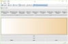</a>
<a href="https://drive.google.com/open?id=1-LwvEHhSHIyuLrCi5i81k7n4BqQqAjZU" target="_blank" title="02">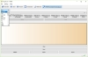</a>
<a href="https://drive.google.com/open?id=1XbszM4KxwBoOcsjvHAZABKxohbdmaBmG" target="_blank" title="03">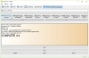</a>
<a href="https://drive.google.com/open?id=1MdOOr33fJF0ck6a7VviAW-anBf76uiN2" target="_blank" title="04">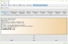</a>
<a href="https://drive.google.com/open?id=1sGGsaiklYSjEHkfWZrT8bRky8NErvDYj" target="_blank" title="05">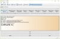</a>
<a href="https://drive.google.com/open?id=1CiOp8aX8ccFnewt9qN-WYd6c6JUrjee0" target="_blank" title="06">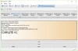</a>
<a href="https://drive.google.com/open?id=1sw21f7NvLXHJzdon2l_gtRJ3ON51X_JW" target="_blank" title="07">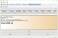</a>
<a href="https://drive.google.com/open?id=1hczvw6jeIGuX4rAYu9Lv3_dDkYuKhpz9" target="_blank" title="08">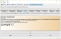</a>
<a href="https://drive.google.com/open?id=175SvF4Vu6x38XJZBBkS_mp1GaMOdF5v5" target="_blank" title="09"></a>
<a href="https://drive.google.com/open?id=1EMQS8XppNPfUHV5IMkFQzNUoXxoMoPRI" target="_blank" title="10">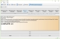</a>
<a href="https://drive.google.com/open?id=1hsoELTmdzVgh38y-N8oFPeCxMvi1EU4H" target="_blank" title="11">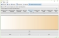</a>
<a href="https://drive.google.com/open?id=127yiIdLSgTICDtHvjyEtwYXuXE2PBizP" target="_blank" title="12">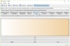</a>
<a href="https://drive.google.com/open?id=1agSYw-N5jUJ73ZOp-R7YsWmbymYV-PJS" target="_blank" title="13">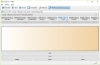</a>
<a href="https://drive.google.com/open?id=1i-V3izMaMA0ntSlm5rH9KRZz-HZtNbiC" target="_blank" title="14">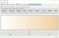</a>
<a href="https://drive.google.com/open?id=1DkN988aybA5rHFpElAQ9_IXiHZ0s9Mty" target="_blank" title="15">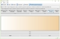</a>
<a href="https://drive.google.com/open?id=1BiC84UDwN48C8gFwhT9bIQKJvkZP9_1B" target="_blank" title="16">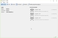</a>
<a href="https://drive.google.com/open?id=1eSShgoTpnnv93Zu4QlVsyzpOF0EswChD" target="_blank" title="17">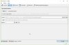</a>
<a href="https://drive.google.com/open?id=1IAjA6tvSTKD-LmrZ430tLF85VfG-_tH3" target="_blank" title="18">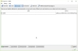</a>
<a href="https://drive.google.com/open?id=1NLfhFSYWvY1E5g2WZsctMCvJz-KL7TvA" target="_blank" title="19">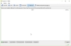</a>
<a href="https://drive.google.com/open?id=1nfFI9BejhByieCU7fiNSMkAzoZMmHP2l" target="_blank">SlideShow</a>
</td></tr>
</table>

<h2>Downloads [<a href="https://github.com/angelcoinmoney/angelcoin/releases" target="_blank">github</a>]:</h2>
<table class="t3">
<tr><caption><a href="https://github.com/angelcoinmoney/angelcoin/releases/tag/v1.0.0.0-win64-portable" target="_blank">Angelcoin-1.0.0.0-win64-portable:</a></caption></tr>
<tr><td><a href="https://github.com/angelcoinmoney/angelcoin/releases/download/v1.0.0.0-win64-portable/angelcoin-1.0.0.0-opencl-win64-portable.zip" target="_blank">angelcoin-1.0.0.0-opencl-win64-portable.zip</a></td><td>&#160;<a href="https://github.com/angelcoinmoney/angelcoin/releases/download/v1.0.0.0-win64-portable/angelcoin-1.0.0.0-opencl-win64-portable.sha512" target="_blank">angelcoin-1.0.0.0-opencl-win64-portable.sha512</a></td><td>&#160;<a href="https://github.com/angelcoinmoney/angelcoin/releases/download/v1.0.0.0-win64-portable/angelcoin-1.0.0.0-win64-portable.zip" target="_blank">angelcoin-1.0.0.0-win64-portable.zip</a></td><td>&#160;<a href="https://github.com/angelcoinmoney/angelcoin/releases/download/v1.0.0.0-win64-portable/angelcoin-1.0.0.0-win64-portable.sha512" target="_blank">angelcoin-1.0.0.0-win64-portable.sha512</a></td></tr>
</table>
 
 
<table class="t3">
<tr><caption><a href="https://github.com/angelcoinmoney/angelcoin/releases/tag/v1.0.0.0-win32-portable" target="_blank">Angelcoin-1.0.0.0-win32-portable:</a></caption></tr>
<tr><td><a href="https://github.com/angelcoinmoney/angelcoin/releases/download/v1.0.0.0-win32-portable/angelcoin-1.0.0.0-opencl-win32-portable.zip" target="_blank">angelcoin-1.0.0.0-opencl-win32-portable.zip</a></td><td>&#160;<a href="https://github.com/angelcoinmoney/angelcoin/releases/download/v1.0.0.0-win32-portable/angelcoin-1.0.0.0-opencl-win32-portable.sha512" target="_blank">angelcoin-1.0.0.0-opencl-win32-portable.sha512</a></td><td>&#160;<a href="https://github.com/angelcoinmoney/angelcoin/releases/download/v1.0.0.0-win32-portable/angelcoin-1.0.0.0-win32-portable.zip" target="_blank">angelcoin-1.0.0.0-win32-portable.zip</a></td><td>&#160;<a href="https://github.com/angelcoinmoney/angelcoin/releases/download/v1.0.0.0-win32-portable/angelcoin-1.0.0.0-win32-portable.sha512" target="_blank">angelcoin-1.0.0.0-win32-portable.sha512</a></td></tr>
</table>
 
 
<table class="t3">
<tr><caption><a href="https://github.com/angelcoinmoney/angelcoin/releases/tag/v1.0.0.0-win64-setup" target="_blank">Angelcoin-1.0.0.0-win64-setup:</a></caption></tr>
<tr><td><a href="https://github.com/angelcoinmoney/angelcoin/releases/download/v1.0.0.0-win64-setup/angelcoin-1.0.0.0-opencl-win64-setup.exe" target="_blank">angelcoin-1.0.0.0-opencl-win64-setup.exe</a></td><td>&#160;<a href="https://github.com/angelcoinmoney/angelcoin/releases/download/v1.0.0.0-win64-setup/angelcoin-1.0.0.0-opencl-win64-setup.sha512" target="_blank">angelcoin-1.0.0.0-opencl-win64-setup.sha512</a></td><td>&#160;<a href="https://github.com/angelcoinmoney/angelcoin/releases/download/v1.0.0.0-win64-setup/angelcoin-1.0.0.0-win64-setup.exe" target="_blank">angelcoin-1.0.0.0-win64-setup.exe</a></td><td>&#160;<a href="https://github.com/angelcoinmoney/angelcoin/releases/download/v1.0.0.0-win64-setup/angelcoin-1.0.0.0-win64-setup.sha512" target="_blank">angelcoin-1.0.0.0-win64-setup.sha512</a></td></tr>
</table>
 
 
<table class="t3">
<tr><caption><a href="https://github.com/angelcoinmoney/angelcoin/releases/tag/v1.0.0.0-win32-setup" target="_blank">Angelcoin-1.0.0.0-win32-setup:</a></caption></tr>
<tr><td><a href="https://github.com/angelcoinmoney/angelcoin/releases/download/v1.0.0.0-win32-setup/angelcoin-1.0.0.0-opencl-win32-setup.exe" target="_blank">angelcoin-1.0.0.0-opencl-win32-setup.exe</a></td><td>&#160;<a href="https://github.com/angelcoinmoney/angelcoin/releases/download/v1.0.0.0-win32-setup/angelcoin-1.0.0.0-opencl-win32-setup.sha512" target="_blank">angelcoin-1.0.0.0-opencl-win32-setup.sha512</a></td><td>&#160;<a href="https://github.com/angelcoinmoney/angelcoin/releases/download/v1.0.0.0-win32-setup/angelcoin-1.0.0.0-win32-setup.exe" target="_blank">angelcoin-1.0.0.0-win32-setup.exe</a></td><td>&#160;<a href="https://github.com/angelcoinmoney/angelcoin/releases/download/v1.0.0.0-win32-setup/angelcoin-1.0.0.0-win32-setup.sha512" target="_blank">angelcoin-1.0.0.0-win32-setup.sha512</a></td></tr>
</table>

<h2>Downloads [<a href="https://github.com/angelcoinmoney/angelcoin/releases" target="_blank">github</a>]:</h2>
<table class="t3">
<tr><caption><a href="https://github.com/angelcoinmoney/angelcoin/releases" target="_blank">All/Archives</a></caption></tr>
</table>

<h2>Downloads [<a href="https://www.angelcoin.money/Releases/" target="_blank">mirror #1</a>]:</h2>
<table class="t3">
<tr><caption><a href="https://www.angelcoin.money/Releases/" target="_blank">All/Archives</a></caption></tr>
</table>

<h2>Setup:</h2>
<ul>
<li>Allow AngelcoinD.exe and AngelcoinQt.exe in your Windows OS firewall</li>
<li>Spectre, Spectre Prime, Meltdown and Meltdown Prime exploits protection: During works of Angelcoin, close and do not use any other programs, especially browsers like: Internet Explorer, Edge, Chrome, Firefox, Opera, etc.</li>
<li><b>Portable version:</b>
	<ul>
	<li>Start "AngelcoinQt-mainnet.bat" to reach MainNet via GUI</li>
	<li>Start "AngelcoinQt-testnet.bat" to reach TestNet via GUI</li>
	<li>Start "AngelcoinD-mainnet.bat" to reach MainNet via command-prompt</li>
	<li>Start "AngelcoinD-testnet.bat" to reach TestNet via command-prompt</li>
	<li>The path to your portable wallet.dat for MainNet in Windows OS: <i>"&#60;yourextractdirectory&#62;\Angelcoin\"</i></li>
	<li>The path to your portable wallet.dat for TestNet in Windows OS: <i>"&#60;yourextractdirectory&#62;\Angelcoin-testnet\testnet3\"</i></li>
	</ul>
</li>
<li><b>Installation version:</b>
	<ul>
	<li>Start "AngelcoinQt.exe" to reach MainNet via GUI</li>
	<li>Start "AngelcoinQt.exe -testnet" to reach TestNet via GUI</li>
	<li>Start "AngelcoinD.exe" to reach MainNet via command-prompt</li>
	<li>Start "AngelcoinD.exe -testnet" to reach TestNet via command-prompt</li>
	<li>The path to your installation wallet.dat for MainNet in Windows OS: <i>"C:\Users\&#60;username&#62;\AppData\Roaming\Angelcoin\"</i></li>
	<li>The path to your installation wallet.dat for TestNet in Windows OS: <i>"C:\Users\&#60;username&#62;\AppData\Roaming\Angelcoin\testnet3\"</i></li>
	</ul>
</li>
</ul>

<h2>Tutorials:</h2>
<ul>
<li><b><u>Mining ALC coins with Installation version:</u></b>
	<ol>
	<li>Create empty text file "Angelcoin.conf" and placed in <i>"C:\Users\&#60;username&#62;\AppData\Roaming\Angelcoin\"</i> for both MainNet and TestNet</li>
	<li>Create three lines in it (exactly as shown <a href="https://drive.google.com/file/d/19fVp4G9WB44otZtFpAzdMQhrYPXx_fB8/view" target="_blank">here</a>):
		<ol>
			<li>server=1</li>
			<li>rpcuser=username</li>
			<li>rpcpassword=password</li>
		</ol>
	</li>
	<li>Or download this file from <a href="https://drive.google.com/file/d/19fVp4G9WB44otZtFpAzdMQhrYPXx_fB8/view" target="_blank">here</a></li>
	<li>Follow the steps for "Mining ALC coins with Portable version" (next chapter)- they are both the same for Portable and Installation versions</li>
	</ol>
</li>
<li><b><u>Mining ALC coins with Portable version:</u></b>
	<ol>
	<li>Start any portable version</li>
	<li>Select "MINERS[coin][address][cpu][gpu]" tab. <a href="https://drive.google.com/file/d/1dnrRHobUt24p857LAfyZYuALMJ34VPY7/view" target="_blank">Exact example (screenshot #01)</a></li>
	<li>Choose your coin miner:
		<ol type="a">
		<li><b>MINER[coin][cpu]CPUminer:</b>
			<ol>
				<li>Insert "<mark> -a scrypt -o http://127.0.0.1:6332 -O username:password</mark>" (without quotes) into textbox (or select 12th option from combobox). <a href="https://drive.google.com/file/d/1hsoELTmdzVgh38y-N8oFPeCxMvi1EU4H/view" target="_blank">Exact example (screenshot #11)</a></li>
				<li>Click on "MINER[coin][cpu]CPUminer" button</li>
			</ol>
			<ul>
				<li>Note: if you want to automatic send the mined coins to a specific address then use "--coinbase-addr=" argument into textbox (or select 13th option from combobox).  <a href="https://drive.google.com/file/d/127yiIdLSgTICDtHvjyEtwYXuXE2PBizP/view" target="_blank">Exact example (screenshot #12)</a></li>
				<li>Note: For TestNet mining replace "6332" with "16332"</li>
			</ul>
			</li>
		<li><b>MINER[coin][gpu]CCminer:</b>
			<ol>
				<li>Insert "<mark> -a scrypt -o http://127.0.0.1:6332 -O username:password</mark>" (without quotes) into textbox (or select 12th option from combobox). <a href="https://drive.google.com/file/d/1agSYw-N5jUJ73ZOp-R7YsWmbymYV-PJS/view" target="_blank">Exact example (screenshot #13)</a></li>
				<li>Click on "MINER[coin][gpu]CCminer" button</li>
			</ol>
			<ul>
				<li>Note: For TestNet mining replace "6332" with "16332"</li>
				<li>Note: GPU mining requires using of OpenCL version of Angelcoin and availability of ATI or NVIDIA card</li>
			</ul>
			</li>
		<li><b>MINER[coin][gpu]CGminer:</b>
			<ol>
				<li>Insert "<mark> --scrypt -o http://127.0.0.1:6332 -u username -p password --intensity 10</mark>" (without quotes) into textbox (or select 14th option from combobox). <a href="https://drive.google.com/file/d/1i-V3izMaMA0ntSlm5rH9KRZz-HZtNbiC/view" target="_blank">Exact example (screenshot #14)</a></li>
				<li>Click on "MINER[coin][gpu]CGminer" button</li>
			</ol>
			<ul>
				<li>Note: For TestNet mining replace "6332" with "16332"</li>
				<li>Note: GPU mining requires using of OpenCL version of Angelcoin and availability of ATI or NVIDIA card</li>
			</ul>
			</li>
		<li><b>MINER[coin][gpu]BFGminer:</b>
			<ol>
				<li>Insert "<mark> --scrypt -o http://127.0.0.1:6332 -u username -p password -S opencl:auto --set-device OCL:intensity=10 --set-device OCL0:intensity=10</mark>" (without quotes) into textbox (or select 15th option from combobox). <a href="https://drive.google.com/file/d/1DkN988aybA5rHFpElAQ9_IXiHZ0s9Mty/view" target="_blank">Exact example (screenshot #15)</a></li>
				<li>Click on "MINER[coin][gpu]BFGminer" button</li>
			</ol>
			<ul>
				<li>Note: If not succeed, then repeat the start 3-5 times consecutivly one after another</li>
				<li>Note: For TestNet mining replace "6332" with "16332"</li>
				<li>Note: GPU mining requires using of OpenCL version of Angelcoin and availability of ATI or NVIDIA card</li>
			</ul>
			</li>
		</ol>
	</li>
	</ol>
</li>
<li><b><u>Mining ALC coins in [POOL]:<a href="https://hyperpool.ro" target="_blank">Hyperpool (without registration)</a> with Portable/Installation version:</u></b>
	<ol>
	<li>Start any portable/installation version</li>
	<li>Select "MINERS[coin][address][cpu][gpu]" tab. <a href="https://drive.google.com/file/d/1dnrRHobUt24p857LAfyZYuALMJ34VPY7/view" target="_blank">Exact example (screenshot #01)</a></li>
	<li>Choose your coin miner:
		<ol type="a">
		<li><b>MINER[coin][cpu]CPUminer:</b>
			<ol>
				<li>Insert "<mark> -a scrypt -o stratum+tcp://hyperpool.ro:3433 -u Your_Wallet_Address -p c=ANGEL</mark>" (without quotes) into textbox (or select 16th option from combobox)</li>
				<li>Replace "Your_Wallet_Address" with your actual receiving address</li>
				<li>Click on "MINER[coin][cpu]CPUminer" button</li>
			</ol>
			<ul>
				<li>Note: Allow "&#60;AngelcoinDirectory&#62;\Miner-coin-CPU-minerd\minerd.exe" in your Windows OS firewall</li>
				<li>Note: For TestNet mining replace "6332" with "16332"</li>
			</ul>
			</li>
		<li><b>MINER[coin][gpu]CCminer:</b>
			<ol>
				<li>Insert "<mark> -a scrypt -o stratum+tcp://hyperpool.ro:3433 -u Your_Wallet_Address -p c=ANGEL</mark>" (without quotes) into textbox (or select 16th option from combobox)</li>
				<li>Replace "Your_Wallet_Address" with your actual receiving address</li>
				<li>Click on "MINER[coin][gpu]CCminer" button</li>
			</ol>
			<ul>
				<li>Note: Allow "&#60;AngelcoinDirectory&#62;\Miner-coin-GPU-ccminer\ccminer.exe" in your Windows OS firewall</li>
				<li>Note: For TestNet mining replace "6332" with "16332"</li>
				<li>Note: GPU mining requires using of OpenCL version of Angelcoin and availability of ATI or NVIDIA card</li>
			</ul>
			</li>
		<li><b>MINER[coin][gpu]CGminer:</b>
			<ol>
				<li>Insert "<mark> --scrypt -o stratum+tcp://hyperpool.ro:3433 -u Your_Wallet_Address -p c=ANGEL</mark>" (without quotes) into textbox (or select 17th option from combobox)</li>
				<li>Replace "Your_Wallet_Address" with your actual receiving address</li>
				<li>Click on "MINER[coin][gpu]CGminer" button</li>
			</ol>
			<ul>
				<li>Note: Allow "&#60;AngelcoinDirectory&#62;\Miner-coin-GPU-cgminer\cgminer.exe" in your Windows OS firewall</li>
				<li>Note: For TestNet mining replace "6332" with "16332"</li>
				<li>Note: GPU mining requires using of OpenCL version of Angelcoin and availability of ATI or NVIDIA card</li>
			</ul>
			</li>
		<li><b>MINER[coin][gpu]BFGminer:</b>
			<ol>
				<li>Insert "<mark> --scrypt -S opencl:auto --set-device OCL:intensity=10 --set-device OCL0:intensity=10 -o stratum+tcp://hyperpool.ro:3433 -u Your_Wallet_Address -p c=ANGEL</mark>" (without quotes) into textbox (or select 18th option from combobox)</li>
				<li>Replace "Your_Wallet_Address" with your actual receiving address</li>
				<li>Click on "MINER[coin][gpu]BFGminer" button</li>
			</ol>
			<ul>
				<li>Note: Allow "&#60;AngelcoinDirectory&#62;\Miner-coin-GPU-bfgminer\bfgminer.exe" in your Windows OS firewall</li>
				<li>Note: If not succeed, then repeat start 3-5 times consecutivly one after another</li>
				<li>Note: For TestNet mining replace "6332" with "16332"</li>
				<li>Note: GPU mining requires using of OpenCL version of Angelcoin and availability of ATI or NVIDIA card</li>
			</ul>
			</li>
		</ol>
	</li>
	</ol>
</li>
<li><b><u>Mining addresses with Portable/Installation versions:</u></b>
	<ol>
	<li>Start any portable/installation version</li>
	<li>Select "MINERS[coin][address][cpu][gpu]" tab. <a href="https://drive.google.com/file/d/1dnrRHobUt24p857LAfyZYuALMJ34VPY7/view" target="_blank">Exact example (screenshot #01)</a></li>
	<li>Choose your address miner:
		<ol type="a">
		<li><b>MINER[address][cpu]Vanitygen:</b>
			<ul>
			<li>Mining ALC addresses:
				<ol>
					<li>Choose "ALC" in combobox (select 2nd option from combobox). <a href="https://drive.google.com/file/d/1-LwvEHhSHIyuLrCi5i81k7n4BqQqAjZU/view" target="_blank">Exact example (screenshot #02)</a></li>
					<li>Insert pattern into textbox</li>
					<li>Click on "MINER[address][cpu]Vanitygen" button. <a href="https://drive.google.com/file/d/1XbszM4KxwBoOcsjvHAZABKxohbdmaBmG/view" target="_blank">Exact example (screenshot #03)</a></li>
				</ol>
			</li>
			<li>Mining BTC addresses:
				<ol>
					<li>Choose "BTC" in combobox (select 4th option from combobox). <a href="https://drive.google.com/file/d/1-LwvEHhSHIyuLrCi5i81k7n4BqQqAjZU/view" target="_blank">Exact example (screenshot #02)</a></li>
					<li>Insert pattern into textbox</li>
					<li>Click on "MINER[address][cpu]Vanitygen" button. <a href="https://drive.google.com/file/d/1MdOOr33fJF0ck6a7VviAW-anBf76uiN2/view" target="_blank">Exact example (screenshot #04)</a></li>
				</ol>
			</li>
			<li>Mining BTC SegWit addresses:
				<ol>
					<li>Choose "BTCsw" in combobox (select 6th option from combobox). <a href="https://drive.google.com/file/d/1-LwvEHhSHIyuLrCi5i81k7n4BqQqAjZU/view" target="_blank">Exact example (screenshot #02)</a></li>
					<li>Insert pattern into textbox</li>
					<li>Click on "MINER[address][cpu]Vanitygen" button. <a href="https://drive.google.com/file/d/1sGGsaiklYSjEHkfWZrT8bRky8NErvDYj/view" target="_blank">Exact example (screenshot #05)</a></li>
				</ol>
			</li>
			</ul>
		</li>
		<li><b>MINER[address][gpu]oclVanitygen:</b>
			<ul>
			<li>Mining ALC addresses:
				<ol>
					<li>Choose "ALC" in combobox (select 2nd option from combobox). <a href="https://drive.google.com/file/d/1-LwvEHhSHIyuLrCi5i81k7n4BqQqAjZU/view" target="_blank">Exact example (screenshot #02)</a></li>
					<li>Insert pattern into textbox</li>
					<li>Click on "MINER[address][gpu]oclVanitygen" button. <a href="https://drive.google.com/file/d/1CiOp8aX8ccFnewt9qN-WYd6c6JUrjee0/view" target="_blank">Exact example (screenshot #06)</a></li>
				</ol>
				<ul>
					<li>Note: GPU mining requires using of OpenCL version of Angelcoin and availability of ATI or NVIDIA card</li>
				</ul>
			</li>
			<li>Mining BTC addresses:
				<ol>
					<li>Choose "BTC" in combobox (select 4th option from combobox). <a href="https://drive.google.com/file/d/1-LwvEHhSHIyuLrCi5i81k7n4BqQqAjZU/view" target="_blank">Exact example (screenshot #02)</a></li>
					<li>Insert pattern into textbox</li>
					<li>Click on "MINER[address][gpu]oclVanitygen" button. <a href="https://drive.google.com/file/d/1sw21f7NvLXHJzdon2l_gtRJ3ON51X_JW/view" target="_blank">Exact example (screenshot #07)</a></li>
				</ol>
				<ul>
					<li>Note: GPU mining requires using of OpenCL version of Angelcoin and availability of ATI or NVIDIA card</li>
				</ul>
			</li>
			</ul>
		</li>
		</ol>
	</li>
	</ol>
</li>
<li><b><u>Generating addresses with Portable/Installation versions:</u></b>
	<ol>
	<li>Start any portable/installation version</li>
	<li>Select "MINERS[coin][address][cpu][gpu]" tab. <a href="https://drive.google.com/file/d/1dnrRHobUt24p857LAfyZYuALMJ34VPY7/view" target="_blank">Exact example (screenshot #01)</a></li>
	<li>Choose your address generator:
		<ol type="a">
		<li><b>GEN[address]Keyconv:</b>
			<ul>
			<li>Creating ALC addresses:
				<ol>
					<li>Choose "ALC" in combobox (select 2nd option from combobox). <a href="https://drive.google.com/file/d/1-LwvEHhSHIyuLrCi5i81k7n4BqQqAjZU/view" target="_blank">Exact example (screenshot #02)</a></li>
					<li>Leave empty textbox or insert a privkey to receive its associate address- <a href="https://drive.google.com/file/d/1hczvw6jeIGuX4rAYu9Lv3_dDkYuKhpz9/view" target="_blank">Exact example (screenshot #08)</a></li>
					<li>Click on "GEN[address]Keyconv" button. <a href="https://drive.google.com/file/d/175SvF4Vu6x38XJZBBkS_mp1GaMOdF5v5/view" target="_blank">Exact example (screenshot #09)</a></li>
				</ol>
			</li>
			<li>Creating BTC addresses:
				<ol>
					<li>Choose "BTC" in combobox (select 4th option from combobox). <a href="https://drive.google.com/file/d/1-LwvEHhSHIyuLrCi5i81k7n4BqQqAjZU/view" target="_blank">Exact example (screenshot #02)</a></li>
					<li>Leave empty textbox</li>
					<li>Click on "GEN[address]Keyconv" button. <a href="https://drive.google.com/file/d/1EMQS8XppNPfUHV5IMkFQzNUoXxoMoPRI/view" target="_blank">Exact example (screenshot #10)</a></li>
				</ol>
			</li>
			</ul>
		</li>
		<li><b>GEN[address]HTML5:</b>
			<ul>
			<li>Creating 197 different cryptocurrency addresses:
				<ul>
					<li>Click on "GEN[address]HTML5" button to start in offline regime the WalletGenerator.net- Universal Paper wallet generator for Bitcoin and other cryptocurrencies</li>
				</ul>
			</li>
			</ul>
		</li>
		</ol>
	</li>
	</ol>
</li>
</ul>

<h2>Terms of use. Disclaimer:</h2>
<ul>
<li>This software functions as a free and open source digital cryptocurrency wallet</li>
<li>The software does not constitute an account where the developer of this software or other third parties serve as financial intermediaries or custodians of your coins or other valuables</li>
<li>While the software has undergone beta testing and continues to be improved by feedback from the open-source user and developer community, we cannot guarantee that there will be no bugs in the software</li>
<li>You acknowledge that your use of this software is at your own discretion and in compliance with all applicable laws</li>
<li>You are responsible for safekeeping your passwords, private key pairs, PINs and any other codes you use to access the software</li>
<li><b>IF YOU LOSE ACCESS TO YOUR ANGELCOIN WALLET, YOU ACKNOWLEDGE AND AGREE THAT ANY COINS OR OTHER VALUABLES YOU HAVE ASSOCIATED WITH THAT ANGELCOIN WALLET WILL BECOME INACCESSIBLE!</b></li>
<li>All transaction requests are irreversible</li>
<li>The authors of the software cannot retrieve your private keys or passwords if you lose or forget them and cannot guarantee transaction confirmation as they do not have control over the Angelcoin network</li>
<li>To the fullest extent permitted by law, this software is provided "as is" and no representations or warranties can be made of any kind, express or implied, including but not limited to the warranties of merchantability, fitness or a particular purpose and no infringement</li>
<li>You assume any and all risks associated with the use of the software</li>
<li>In no event shall the authors of the software be held liable for any claim, damages or other liability, whether in an action of contract, tort, or otherwise, arising from, out of or in connection with the software</li>
<li>We reserve the right to modify this disclaimer when needed</li>
<li><b>BY DOWNLOADING, INSTALLING AND USING OF THIS SOFTWARE I AFFIRM THAT I HAVE READ, UNDERSTOOD, AND AGREE WITH THESE TERMS</b></li>
</ul>

<h2>Contact:</h2>
<ul>
<li> <a href="&#109;&#097;&#105;&#108;&#116;&#111;&#58;&#99;&#111;&#110;&#116;&#97;&#99;&#116;&#64;&#97;&#110;&#103;&#101;&#108;&#99;&#111;&#105;&#110;&#46;&#109;&#111;&#110;&#101;&#121;">&#99;&#111;&#110;&#116;&#97;&#99;&#116;&#64;&#97;&#110;&#103;&#101;&#108;&#99;&#111;&#105;&#110;&#46;&#109;&#111;&#110;&#101;&#121;</a> </li>
</ul>

<h2>Donation:</h2>
<ul>
<li> 1ALCdnMP44gyBS6ziLDHypv4bRBxT9TfyR</li>
</ul>